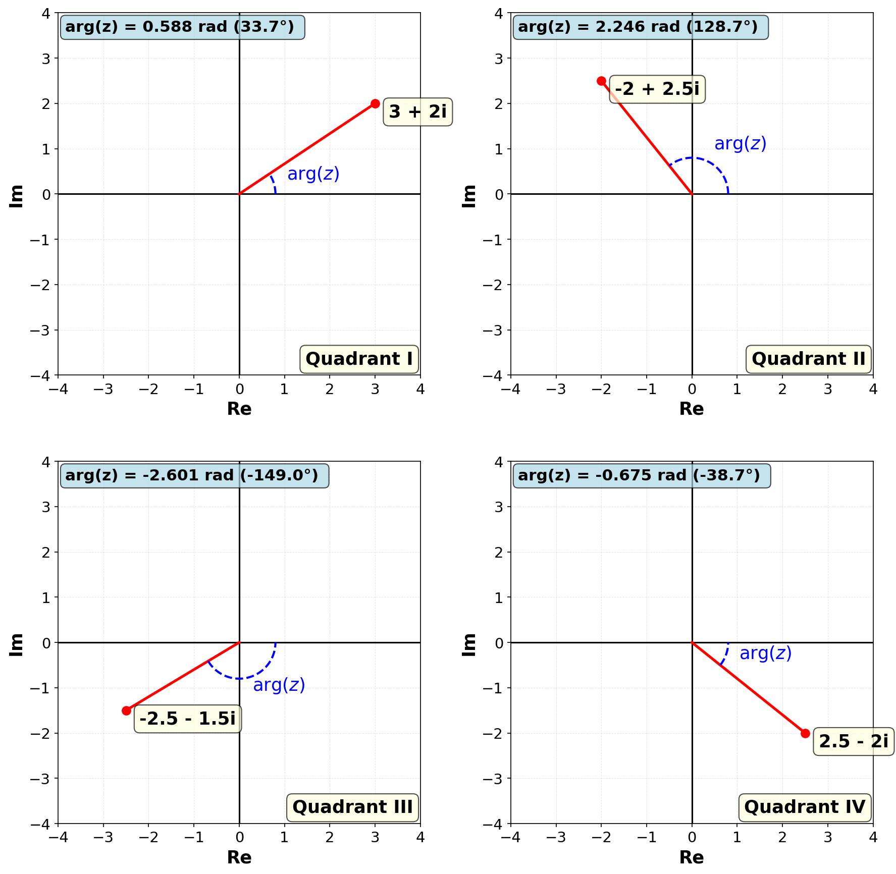

The **argument** (or **phase angle**) of a complex number is the angle that the line from the origin to the complex number makes with the positive real axis of an Argand diagram, measured anticlockwise. For a complex number $z = x + iy$, the argument is often denoted as $\arg(z)$ or $\phi$.

# Geometric Interpretation

On the complex plane, imagine a ray starting at the origin and pointing to the complex number $z$. The argument is the angle this ray makes with the positive real axis:

# Principal Value

The argument of a complex number is **multi-valued** because adding any multiple of $2\pi$ radians (or $360°$) gives the same point on the plane. The **principal value** of the argument is the one which is normally used and is the unique value in the range $(-180°, 180°]$ or $(-\pi, \pi]$ radians.

# Calculating the Argument

The formula used to calculate the argument of a complex number $z = x + iy$ depends on which quadrant the complex number lies in:

- **Quadrant I**: $\arg(z) = \tan^{-1}\left(\frac{y}{x}\right)$ returns [0, $\pi/2$]
- **Quadrant II**: $\arg(z) = \pi + \tan^{-1}\left(\frac{y}{x}\right)$ returns [$\pi/2$, $\pi$]
- **Quadrant III**: $\arg(z) = -\pi + \tan^{-1}\left(\frac{y}{x}\right)$ returns [-$\pi$, -$\pi/2$]
- **Quadrant IV**: $\arg(z) = \tan^{-1}\left(\frac{y}{x}\right)$ returns [-$\pi/2$, 0]

In addition:

- A pure imaginary number (where $x = 0$) has an argument of:
    - $\pi/2$ if $y > 0$
    - $-\pi/2$ if $y < 0$.
- A pure real number (where $y = 0$) has an argument of:
    - $0$ if $x > 0$
    - $\pi$ if $x < 0$.